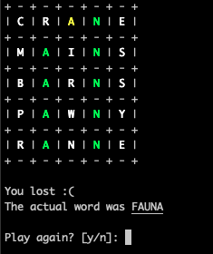

# W0RD13

## Python attempt of the cool word guessing game

### How to play
1. Open a terminal window
2. `cd` to the project root folder
2. Run `python main.py` (or `python3 main.py` depending of your system)
3. Enjoy!

    

    
    
    

### Acknowledgements
Made with love for ***Pam*** by ***Seb*** :heart:
